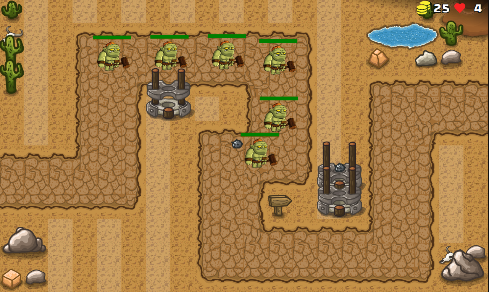

#  **JavaScript Tower Defense Game**

## 	&#127919; **About**
Um jogo no estilo Tower Defense(defender um objetivo com hordas de inimigos)
criando usando **HTML, CSS e JavaScript**.  
Este Projéto foi criado com base no tutorial do Canal <a href="https://www.youtube.com/c/ChrisCourses">Chris Courses</a> 

## 📋**My Experience**
Esse é o segundo projéto do **Chris** que eu faço, adimito que serviu demais para reforcar os mesmos pontos do primeiro projéto **(JavaScript ,Vanilla, Ingês e POO)**.

## 🔧 **Techs**

* HTML (Foi usado para dar corpo ao projéto e disponibilizar o canva)
* CSS (Interface)
* JavaScript (Criação do script geral do game)

## &#127775; **Features**
&#10004; Personagems Interativos e Animados &#10004; Hordas de inimigos &#10004; JavaScript Classes

## <a href="https://thiagofan-towerdefensegame.netlify.app">**Clique aqui para visitar o Projéto**</a>

